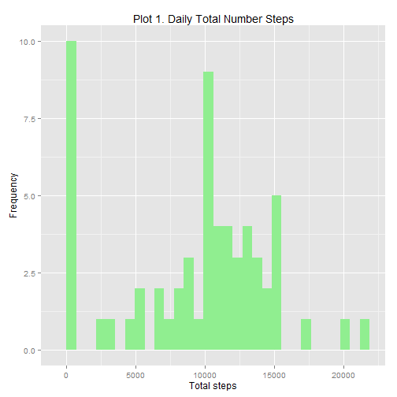

#Peer Assessment Project 1#
######By Jean Rene Ndeki######
######Monday, August 11, 2014######


```r
setwd('C:/Users/Jean-Rene/Desktop/Coursera/7. Reproducible Research/Project 1/Data')
```

####I. Loading and preprocessing the data####

**I.1. Load the data (i.e. read.csv())**


```r
activity <- read.csv("activity.csv")
```

**I.2. Process/transform the data (if necessary) into a format suitable for your analysis**


```r
tsp_Ag <-  aggregate(activity[, 'steps'], by=list(activity$date), sum, na.rm = TRUE)
colnames(tsp_Ag) <- c('Date', 'Steps')
```

####II. What is mean total number of steps taken per day?####

For this part of the assignment, you can ignore the missing values in the dataset.

**II.1. Make a histogram of the total number of steps taken each day**


```r
library(ggplot2)
qplot(tsp_Ag$Steps,geom="histogram",fill=I("light green"), main="Plot 1. Daily Total Number Steps",xlab="Total steps",ylab="Frequency")
```

 

**II.2. Calculate and report the mean and median total number of steps taken per day**


```r
mean(tsp_Ag$Steps)
```

```
## [1] 9354
```

```r
median(tsp_Ag$Steps)
```

```
## [1] 10395
```

####III. What is the average daily activity pattern?####

**III.1. Make a time series plot (i.e. type = "l") of the 5-minute interval (x-axis) and the average number of steps taken, averaged across all days (y-axis)**


```r
time <- formatC(activity$interval/100, 2, format = "f")
activity$datetime <- as.POSIXct(paste(activity$date, time), format = "%Y-%m-%d %H.%M",tz = "GMT")
activity$time <- format(activity$datetime, format = "%H:%M:%S")
activity$time <- as.POSIXct(activity$time, format = "%H:%M:%S")

tspt_Ag <-  aggregate(activity[, 'steps'], by=list(activity$time), sum, na.rm = TRUE)
colnames(tspt_Ag) <- c('Interval', 'Steps')
```


```r
library(scales)
ggplot(tspt_Ag, aes(Interval, Steps)) + 
    geom_line() + 
    ggtitle('Plot 2. Total Number of Steps Taken per Time Interval') +
    xlab("Time Interval") + 
    ylab("Average Number of Steps") + 
    scale_x_datetime(labels = date_format(format = "%H:%M"))
```

 

**III.2. Which 5-minute interval, on average across all the days in the dataset, contains the maximum number of steps?**


```r
max5 <- which.max(tspt_Ag$Steps)
format(tspt_Ag[max5, "Interval"], format = "%H:%M")
```

```
## [1] "08:35"
```

####IV. Imputing missing values####
Note that there is a number of days/intervals where there are missing values (coded as NA). The presence of missing days may introduce bias into some calculations or summaries of the data

**IV.1. Calculate and report the total number of missing values in the dataset (i.e. the total number of rows with NAs)**


```r
summary(activity$steps)
```

```
##    Min. 1st Qu.  Median    Mean 3rd Qu.    Max.    NA's 
##     0.0     0.0     0.0    37.4    12.0   806.0    2304
```


**IV.2. Devise a strategy for filling in all of the missing values in the dataset. The strategy does not need to be sophisticated. For example, you could use the mean/median for that day, or the mean for that 5-minute interval, etc.**


```r
library(Hmisc)
act_imp <- activity
act_imp$steps <- with(act_imp, impute(steps, mean))
```

**IV.3. Create a new dataset that is equal to the original dataset but with the missing data filled in.**


```r
tsp_imp_Ag <-  aggregate(act_imp[, 'steps'], by=list(act_imp$date), sum, na.rm = TRUE)
colnames(tsp_imp_Ag) <- c('Date', 'Steps')
```

**IV. Histogram, Mean, Median, Comparison, and Impact**

**IV.4.1. Make a histogram of the total number of steps taken each day.**


```r
qplot(tsp_imp_Ag$Steps, geom = "histogram", fill=I("blue"), main="Plot 3. Total Number Daily Steps - Imputed",xlab = "Total steps", ylab = "Frequency")
```

 

**IV.4.2. Calculate and report the mean and median total number of steps taken per day**


```r
tsp_imp <- tapply(act_imp$steps, act_imp$date, sum)
```


```r
mean(tsp_imp)
```

```
## [1] 10766
```

```r
median(tsp_imp)
```

```
## [1] 10766
```

**IV.4.3. Do these values differ from the estimates from the first part of the assignment?** 

*Yes. The values differ from the first part estimates. However, notice that the mean and median of the imputed data set are equal.*

**IV.4.4. What is the impact of imputing missing data on the estimates of the total daily number of steps?**


```r
mtsp<-mean(tsp_Ag$Steps)
metsp<-median(tsp_Ag$Steps)
mtspimp<-mean(tsp_imp)
metspimp<-median(tsp_imp)
```


```r
mtspimp-mtsp
```

```
## [1] 1412
```

```r
metspimp-metsp
```

```
## [1] 371.2
```

*The impact is: the imputed missing data set mean and median are higher than those of the dataset with missing values*

####V. Are there differences in activity patterns between weekdays and weekends?####

For this part the weekdays() function may be of some help here. Use the dataset with the filled-in missing values for this part.

**V.1. Create a new factor variable in the dataset with two levels - "weekday" and "weekend" indicating whether a given date is a weekday or weekend day.**


```r
wkday <- function(date) {
    if (weekdays(date) %in% c("Saturday", "Sunday")) {
        return("Weekend")
    } else {
        return("Weekday")
    }
}
wkdays <- sapply(act_imp$datetime, wkday)
act_imp$wkday <- as.factor(wkdays)

mSteps <- tapply(act_imp$steps, interaction(act_imp$time, act_imp$wkday), mean, na.rm = TRUE)

wkdaytypedf <- data.frame(time = as.POSIXct(names(mSteps)), mSteps = mSteps, 
                               wkday = as.factor(c(rep("weekday", 288), rep("weekend", 288))))
```

**V.2. Make a panel plot containing a time series plot (i.e. type = "l") of the 5-minute interval (x-axis) and the average number of steps taken, averaged across all weekday days or weekend days (y-axis). The plot should look something like the following, which was creating using simulated data.**


```r
library(scales)
ggplot(wkdaytypedf, aes(time, mSteps)) + 
    geom_line() + 
    xlab("Time of day") + 
    ylab("Mean number of steps") + 
    ggtitle('Plot 4. Panel Weekday and Weekend Step Average Number - Imputed') +
    scale_x_datetime(labels = date_format(format = "%H:%M")) + 
    facet_grid(. ~ wkday)
```

 
